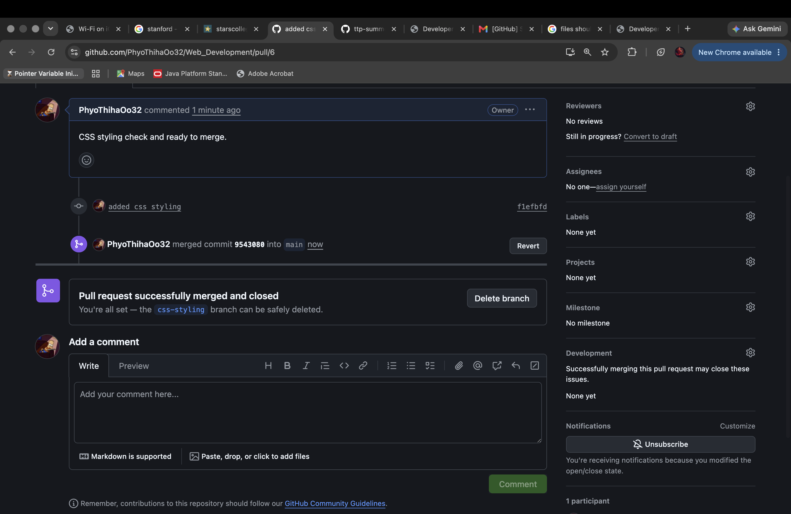
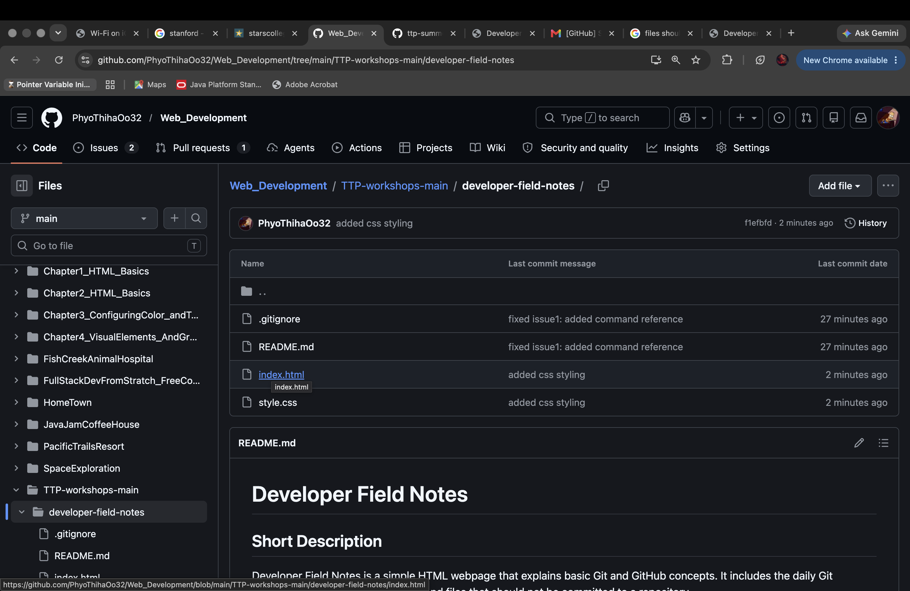

# Developer Field Notes

## Short Description

Developer Field Notes is a simple HTML webpage that explains basic Git and GitHub concepts. It includes the daily Git workflow, common Git commands, and files that should not be committed to a repository.

## Deployed GitHub Pages Site

[View the live site here]
https://github.com/PhyoThihaOo32/Web_Development/tree/main/TTP-workshops-main/developer-field-notes

## Features

- Explains the difference between Git and GitHub
- Shows the daily Git loop: edit, stage, commit, and push
- Lists eight common Git commands with short explanations
- Includes a section on files that should not be committed, such as `.env`, secrets, `node_modules`, and `.DS_Store`
- Adds a simple footer with copyright information

## One Thing I Learned About Git

I learned that Git helps track changes in my code step by step, while GitHub is where I can store and share my Git repository online.

## Git practice screenshot

### Git Status

### Git Branch and Commit

